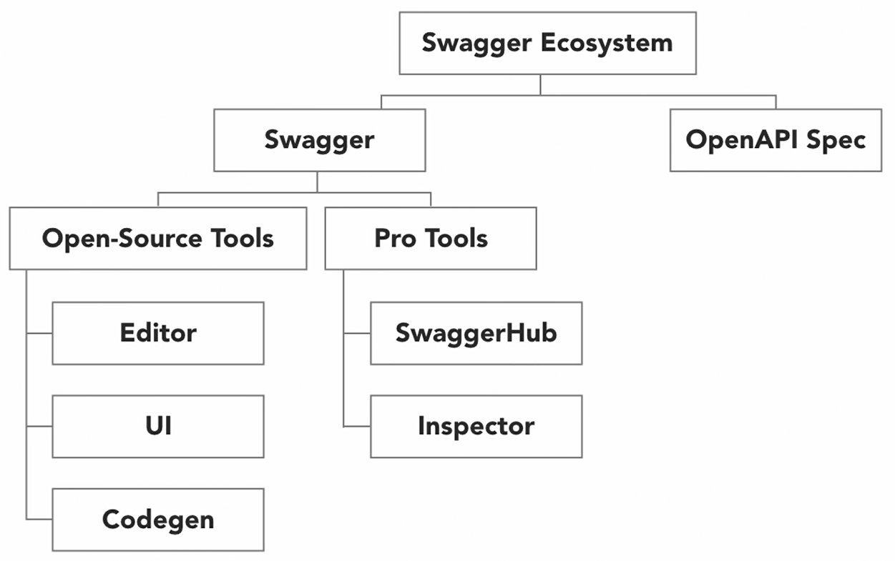
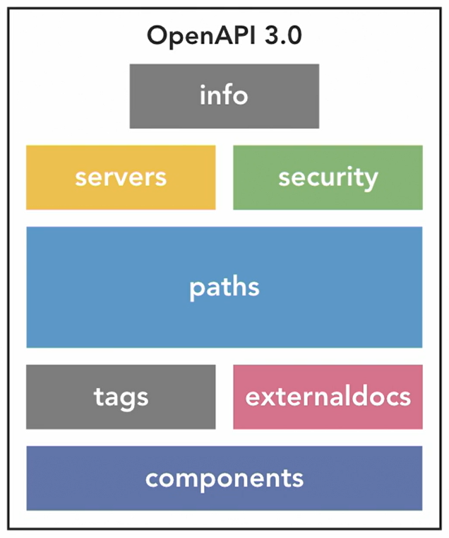

<h1 align="center">Swagger</h1>

---

- [Swagger](#swagger)
  - [History](#history)
  - [Swagger](#swagger-1)
  - [OpenAPI](#openapi)
  - [Open-sourse tools](#open-sourse-tools)
  - [OpenAPI Specification](#openapi-specification)
  - [Open-source tool installation](#open-source-tool-installation)
  - [OpenAPI-Specification - Building a simple API](#openapi-specification---building-a-simple-api)
- [Building OpenAPI Specification](#building-openapi-specification)
  - [Paths with Query Parameters](#paths-with-query-parameters)
  - [Paths with Template Parameters](#paths-with-template-parameters)
  - [Building posts with request bodies](#building-posts-with-request-bodies)
  - [Achieving resuability with component](#achieving-resuability-with-component)
  - [Responce Objects](#responce-objects)
  - [Reusing Parameters](#reusing-parameters)
  - [Content negotiation](#content-negotiation)
  - [Swagger UI](#swagger-ui)
- [Creating and Publishing APIs with SwaggerHub](#creating-and-publishing-apis-with-swaggerhub)
  - [Creating a definition with template](#creating-a-definition-with-template)
  - [Versioning](#versioning)
  - [Import](#import)
  - [Security](#security)
  - [Domains](#domains)
  - [Nesting schemas in domains](#nesting-schemas-in-domains)
  - [Enforcing API Standards](#enforcing-api-standards)
  - [Auto Mocking APIs](#auto-mocking-apis)
  - [Adding organization members](#adding-organization-members)
  - [Inviting individual collaborators](#inviting-individual-collaborators)
  - [Notes](#notes)
- [Shortcut keys](#shortcut-keys)

---

# Swagger

- Swagger is an Interface Description Language for describing RESTful APIs expressed using JSON. Swagger is used together with a set of open-source software tools to design, build, document, and use RESTful web services. Swagger includes automated documentation, code generation, and test-case generation.

- Swagger - a toolset and structured approach for creating API designs, documentation, and code throughout the API lifecycle
- OAS (Open API Specification) - Standard format for metadata used to define RESTful services

## History

- Swagger began 2010, included both the tooling and specification
- Aquired by SmartBear in 2015. SmartBear donated the Swagger specification to keep it vender nutral to the Open API initative and renamed it to OAS.

- Open API Initative - Open API Specification Contributors
  - Microsoft, Google, IBM, Paypal, SmartBear

## Swagger

- Swagger allows us to Design, document, and generate code for API's that adhere to the OAS.
- Open-source tools
  - Swagger editer
  - Swagger UI
  - Swagger Codegen
- Pro tools (free and paid)
  - SwaggerHub
  - Swagger Inspector

## OpenAPI

- Provides a standard format for using metadata for RESTful services



## Open-sourse tools

- Swagger Editor
  - Create OpenAPI definitions
- Swagger UI
  - Generates docs from API definitions
- Swagger Codegen
  - Build client SDK's from API definitions

## OpenAPI Specification

- The OpenAPI Specification (OAS) defines a standard, programming-language-agnositic interface description for REST APIs.

- The OpenAPI Specification tells us how to build API definition files that can be understood by humans or computers to support interaction with REST-based services.

## Open-source tool installation

- Go to: https://github.com/swagger-api
- Then: swagger-ui
- Releases, and download the Source code zip
- Repeat for the swagger-editor

- npm install -g http-server
- go to the swagger-editor folder
  - npm install
- go to the swagger-ui folder

  - npm install

- Navigate to root folder, the folder that contains both swagger-ui and swagger-editor
- To envoke swagger-editor
  - http-server swagger-editor -a 127.0.0.1 -p 8080
- To envoke swagger-ui
  - http-server swagger-ui -a 127.0.0.1 -p 8081

## OpenAPI-Specification - Building a simple API

- https://github.com/OAI/OpenAPI-Specification
- https://github.com/OAI/OpenAPI-Specification/blob/main/versions/3.1.0.md

- Uses .yml so indentation is important

  ```
  openapi: 3.0.0
  info:
  title: H Plus Sports API
  version: 1.0.0
  paths:
  /product:
      get:
      responses:
          200:
          description: This is a list of products in the catalog
          content:
              application/json:
              schema:
                  type: array
                  items:
                  properties:
                      id:
                      type: integer
                      example: 400
                      name:
                      type: string
                      example: Lemon water
  ```

---

# Building OpenAPI Specification



- The infor object provides metadata about the api such as:

  - Description
  - Terms of service
  - Contact information
  - License
  - Version

- The servers object provides metadata about the servers hosting the API implementation
- The security object allows you to describe how the API is secured by specifying information regarding API keys, OWA flows, or security cookies.
- Within the paths object, we can specify multiple paths or end points that describe how to access resources on the API.
- Using the tags object, we can define tags that can be used to group API operations.
- The external doc section allows us to provide links to external resources about the API that are hosted elsewhere.
- The components object allows you to define common schema objects, parameters, request bodies, and responses that may be used throughout the API.

## Paths with Query Parameters

- i.e. /product?pageSize=5-&pageNumber=1

  ```
  paths:
  /article:
      get:
      parameters:
          - in: query
          name: pageNumber
          description: Page number to return
          required: false
          schema:
              type: integer
              example: 1
          - in: query
          name: pageSize
          description: Number of results in the page
          required: false
          schema:
              type: integer
              example: 10
              maximum: 100
  ```

## Paths with Template Parameters

- i.e. /product/{productId}

  ```
  paths:
  /article/{articleId}:
      get:
      parameters:
          - in: path
          name: articleId
          required: true
          schema:
              type: integer
              example: 12345
      responses:
          200:
  ```

- adding header inforamtion

  ```
  paths:
  /article/{articleId}:
      get:
      parameters:
          - in: path
          name: articleId
          required: true
          schema:
              type: integer
              example: 12345
          - in: header
          name: customer-security-header
          required: false
          schema:
              type: integer
              example: 12345-12345-12345-12345
  ```

## Building posts with request bodies

```
    post:
      description: Add a product to the catalog
      requestBody:
        content:
          application/json:
            schema:
              type: object
              properties:
                id:
                  type: integer
                  example: 400
                name:
                  type: string
                  example: Lemon Water
      responses:
        200:
          description: The product has been created.
```

## Achieving resuability with component

- Purpose, DRY, Do-not Repeat Yourself

- Create a component

  ```
  components:
  schemas:
      Product:
      type: object
      required:
          - name
      properties:
          id:
          type: integer
          example: 400
          name:
          type: string
          example: Lemon Water
          description:
          type: string
          example: Lemon Water
          image_title:
          type: string
          example: mineral-water-lemon-lime
          image:
          type: string
          example: https://hplussport.com/images/1234
  ```

- Use reference: $ref in the schema field, replacing all the definitions

  ```
  /product:
      post:
      description: Add a product to the catalog
      requestBody:
          content:
          application/json:
              schema:
              $ref: '#/components/schemas/Product'
      responses:
          200:
          description: The product has been created.
  ```

## Responce Objects

- Create a reusable response

  ```
  responses:
      500ApiError:
      description: This is an unexpected error
      content:
          application/json:
          schema:
              type: object
              properties:
              statusCode:
                  type: string
                  example: 500
              message:
                  type: string
                  example: This is an error
  ```

- Use it throughout the definition using $ref

  ```
      get:
      parameters:
          - in: query
          ...
      responses:
          200:
          ...
          500:
          $ref: '#/components/responses/500ApiError'
  ```

- Acheive a standard error responce

## Reusing Parameters

- Create the parameters

  ```
  components:
  parameters:
      PageNumber:
      in: query
      name: pageNumber
      description: Page number to return
      required: false
      schema:
          type: integer
          example: 1
      PageSize:
      in: query
      name: pageSize
      description: Number of results in the page
      required: false
      schema:
          type: integer
          example: 10
          maximum: 100
  ```

- Then reuse them with $ref

  ```
  /product:
      post:
      description: Add a product to the catalog
      requestBody:
          content:
          application/json:
              schema:
              $ref: '#/components/schemas/Product'
      responses:
          200:
          description: The product has been created.
          500:
          $ref: '#/components/responses/500ApiError'
      get:
      parameters:
          - $ref: '#/components/parameters/PageNumber'
          - $ref: '#/components/parameters/PageSize'
      responses:
          200:
          description: This is a list of the products in the catalog
          content:
              application/json:
              schema:
                  type: array
                  items:
                  $ref: '#/components/schemas/Product'
          500:
          $ref: '#/components/responses/500ApiError'
  ```

## Content negotiation

- Allow for other responces like xml

  ```
      responses:
          200:
          description: This is a list of the products in the catalog
          content:
              application/json:
              schema:
                  $ref: '#/components/schemas/Product'
              application/xml:
              schema:
                  $ref: '#/components/schemas/Product'
  ```

## Swagger UI

- Save the definition as a .yaml
- Copy the saved .yaml file and place within the /dist folder in the swagger-ui build/folder
- Copy the dist folder and paste to a working directory
- Rename to say "api-docs"
- Open the index.html file
  - edit tehe url on line ~42 to the name of your file i.e. hsports-api.yaml
- then run

  - http-server api-docs -a 127.0.0.1 -p 8081

- Which location cannot be used to specify the location a parameter will be found in? JWT
- Where is a template parameter found? in the URL
- The requestBody field is found nested within the **\_** object? operation
- What is the benefit of creating an object in the components section? reusability
- What field can be used to reference a component? $ref
- Which format is valid for building an OAS API definition? YAML
- What is the benefit of content negotiation? We can accept or provide multiple media types for an API operation.
- Swagger UI is used to generate **\_**? API Documentation
- Which section of an API definition allows you to define common objects such as schema objects, parameters, request bodies and response bodies? components
- What is the purpose of a schema object? It defines the inputs an API consumer is expected to provide and the outputs the consumer can expect for an operation.

---

# Creating and Publishing APIs with SwaggerHub

- Cloud based development platform
- Advanced tools based on the opensource tools

  - Domains provide object reasusability across APIs
  - API management capabitlities such as security, versioning, and source control integration
  - API definition and documentation hosting
  - API mocking and virtualization
  - Swagger Editor enhancements

- Benefits
  - Promotes consistent API design across organizations and teams
  - Eases collaboration amongst API developers
  - Reduces time and effort required to design APIs
  - Supports parallel development via a contract-first approach
  -

## Creating a definition with template

- Use the predefined templates and modify to suit

## Versioning

- To publish a version select the verion number and select Publish API, the editor will then become readonly
- Create a new version to make changes by clicking on the version number and selecting add new version
- You can compare versions

## Import

- Import existing .yaml files
- Add tags to group definitions

## Security

- To add security add the following

  ```
  components:
  securitySchemes:
      password:
      type: oauth2
      flows:
          password:
          tokenUrl: 'http://example.com/oauth/token'
          scopes:
              write: allows modifying resources
              read: allows reading resources
  ```

- Then to secure a path then add the below

  ```
  /product:
      post:
      security:
          - password: [write]
  ```

- With a project selected you can
  - Fork
  - Transfer
  - Delete
  - Rename
  -

## Domains

- Create a domain
- Rename and added a description
- Then deleted everything below the Common data models section
- Went and copied the Customer component > schema
- Paste into the Domain schema
- Now can delete the customer schema in the definition
- Then where the schema was referenced delete what was there and hit ctrl > space and select from the available domain schemas

## Nesting schemas in domains

- Can next schemas within other schemas, i.e. customer inside of an order

## Enforcing API Standards

- From home page select the Company > Settings > Standardization to edit standards, add say "Operation must have one and only one tag" then on the home screen any APIs that fail with have a red error flag

## Auto Mocking APIs

- Go to the API and click on View Documentation, another window will open with the documentation

- For most you can click try now

- For APIs that have auth or similar you need to:

  - Go to the SwaggerHub definition
  - Click the name in the top left corner
  - Select Integrations and Add New Integration
  - Select API Auto Mocking
  - Name and then create
  - Then edit and copy the url it creates, i.e. https://virtserver.swaggerhub.com/< owner>/< api>/< version>
  - Then edit the document

    ```
    openapi: 3.0.0
    info:
    title: H Plus Sports Calatog API
    version: 1.0.0
    servers:
    - description: SwaggerHub API Auto Mocking
        url: https://virtserver.swaggerhub.com/KiwiCodes/calatog/1.0.0  get KiwiCodes/calatog/1.0.0 from the url of open document
    ```

## Adding organization members

- To add members
- Go to the Profile > Settings > Members > Members
- And add a new member setting their permission level

## Inviting individual collaborators

- Add member from an API using Share and Collaborate

- To avoid breaking changes, updates to an API should be published as a **\_**? new version
- What API specification format can be imported into Swagger? YAML
- What is the purpose of a security scheme? It defines how sensitive operations on an API are protected.
- Domains provide reuse across **\_**? API definitions
- Schema objects can **\_** other schema objects within their definitions. nest
- API standards can be established at the **\_** level within SwaggerHub. organization
- SwaggerHub provides a **\_** capability that allows API consumers to develop against an API that is currently under development. mocking
- Which of the following is NOT a SwaggerHub capability? oAuth2 Implementation

- Design Driven Development

## Notes

- You can add comments to lines by click the + on each line

---

# Shortcut keys

- ctrl-space - to see the auto completion fields
